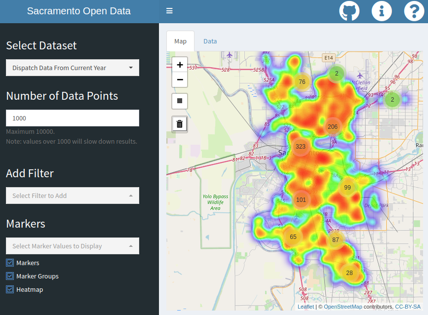

# SacOpenData

[Link to Live Version](https://mvanbommel.shinyapps.io/SacOpenData/)

An app allowing users to view, manipulate, and download various City of Sacramento Open Data Sets. Additionally, a easily ediatable template to repurpose the app for any collection of data sets with GeoServices REST APIs with point geometry objects.

## Building Your Own Version
This app can be easily edited for use with any collection of data sets with [Geoservices](http://geoservices.github.io/) REST APIs that use [point geometry objects](https://developers.arcgis.com/documentation/common-data-types/geometry-objects.htm). Many cities and organizations make their open data sets available through Geoservices, and a full collection of over 180,000 data sets is available on [ArcGIS Hub](https://hub.arcgis.com/search?collection=Dataset).

To create your own version of this app, simply [fork](https://help.github.com/en/github/getting-started-with-github/fork-a-repo) the repository, [rename](https://help.github.com/en/github/administering-a-repository/renaming-a-repository) if desired, and edit the [`data_source_information.R`](https://github.com/mvanbommel/SacOpenData/blob/master/data_source_information.R) script according to the instructions in the comments.

In order to run the app, you will need to [install R](https://cran.r-project.org/) ([installing RStudio](https://rstudio.com/products/rstudio/) is also recommended). When you run the app for the first time, run the command `source("check_packages.R")` and the [`check_packages.R`](https://github.com/mvanbommel/SacOpenData/blob/master/check_packages.R) script will ensure all necessary packages are loaded, and thus load time might be quite slow the first time. If you are unfamiliar with Shiny, there are [tutorials](https://shiny.rstudio.com/tutorial/) available.

To learn more about sharing or publishing your app, see the [Share Your Apps](https://shiny.rstudio.com/tutorial/written-tutorial/lesson7/) tutorial.

## Tools
This app is built using [R](https://www.r-project.org/)'s [Shiny](https://shiny.rstudio.com/) package with the [Shiny Dashboard](https://rstudio.github.io/shinydashboard/) framework. The map is created using the [leaflet](https://rstudio.github.io/leaflet/) package to implement the [Leaflet](https://leafletjs.com/) JavaScript library. API calls are performed using the [mvanbommel/esri2sf](https://github.com/mvanbommel/esri2sf) package (forked from [yonghah/esri2sf](https://github.com/yonghah/esri2sf)).
